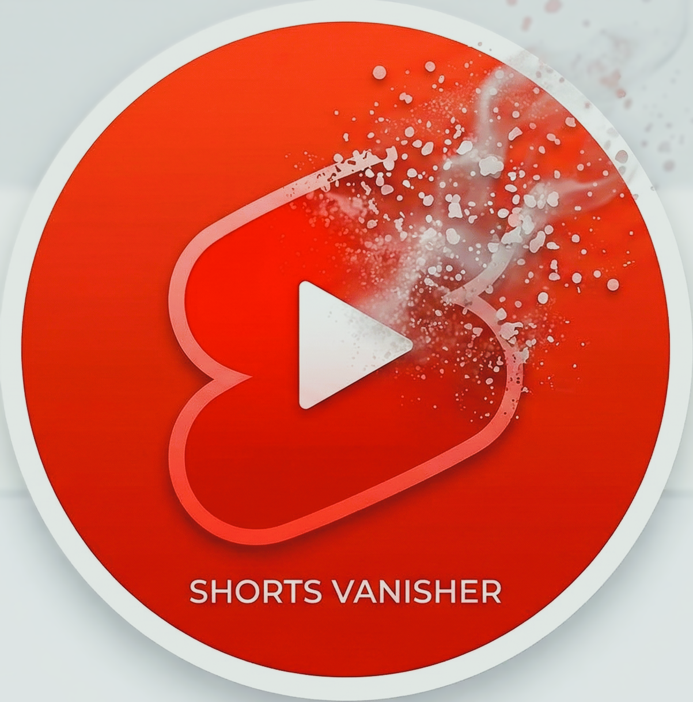

#  Shorts Vanisher

A lightweight, gamified Chrome Extension that declutters your YouTube experience by hiding highly distracting Shorts. 

This extension completely scrubs YouTube of Shorts, targeting the Home Page, Navigation Sidebars, Subscriptions feed, and Creator Channels to keep your feed focused on standard, long-form video content. It also features a built-in stat tracker to show you exactly how many distractions you've successfully avoided.

## Features
* **Complete Shorts Purge:** Automatically detects and hides horizontal Shorts shelves, sidebar navigation links, and the dedicated Shorts tab on creator profiles.
* **Smart URL Redirect:** Intercepts direct `/shorts/` links and instantly redirects them to the standard, non-swipeable YouTube video player.
* **Live Stat Tracker:** A sleek, dark-themed popup UI keeps a running tally of how many Shorts have been vanished during your current session, along with a lifetime total.
* **Quick Toggle:** An easily accessible on/off switch in the popup allows you to pause the extension instantly without navigating to Chrome's extension manager.
* **Performance Optimized:** Uses a targeted `MutationObserver` to remove elements seamlessly and efficiently as YouTube dynamically loads content, preventing layout shifts.

## Installation (Developer Mode)
1. Clone or download this repository to your local machine.
2. Open Google Chrome and navigate to `chrome://extensions/`.
3. Toggle on **Developer mode** in the top right corner.
4. Click **Load unpacked** in the top left corner.
5. Select the `SHORTS-VANISHER` folder.
6. Pin the extension to your toolbar to access the stat tracker and toggle switch!

## Project Structure
* `manifest.json`: Extension configuration and permissions.
* `content.js`: The script injected into YouTube to find, hide Shorts, and handle URL redirects.
* `popup.html` / `popup.css` / `popup.js`: The UI and logic for the extension's dropdown menu and stat trackers.

## Implemented Phases
* **Phase 1:** Purged horizontal Shorts shelves from the YouTube Home Page.
* **Phase 2:** Removed dedicated Shorts links from both the expanded and collapsed left-hand navigation sidebars.
* **Phase 3:** Scrubbed Shorts from the Subscriptions feed and removed the "Shorts" tab from creator Channel pages.
* **Phase 4:** Added a navigation listener to auto-redirect direct `/shorts/` URLs to the standard `/watch?v=` video player format.